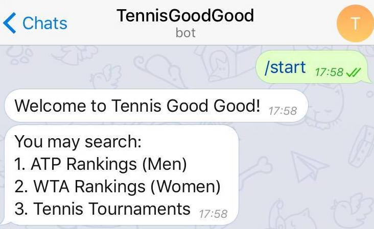
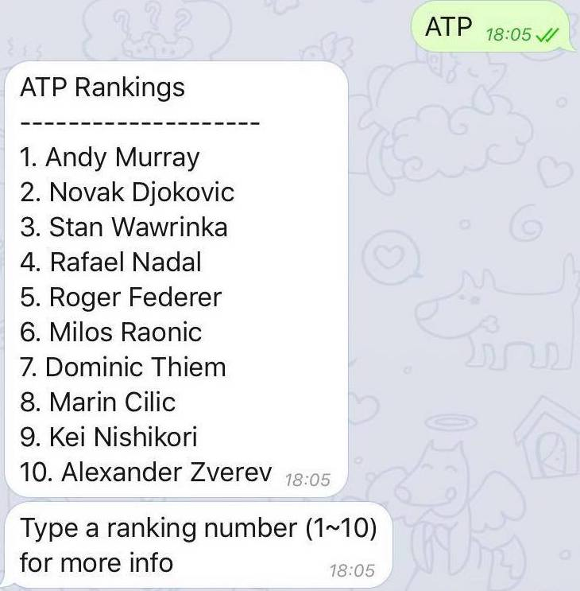

# TOC Project 2017

Tennis Good Good Bot

A telegram bot based on a finite state machine,

which provide service of searching ATP / WTA rankings

also introduction of Tennis Grand Slam.

## Setup

### Prerequisite
* Python 3

#### Install Dependency
```sh
pip install -r requirements.txt
```

* pygraphviz (For visualizing Finite State Machine)
    * [Setup pygraphviz on Ubuntu](http://www.jianshu.com/p/a3da7ecc5303)

### Secret Data

`WEBHOOK_URL` in app.py **MUST** be set to proper values.
Otherwise, you might not be able to run your code.

### Run Locally
You can either setup https server or using `ngrok` as a proxy.

**`ngrok` would be used in the following instruction**

```sh
./ngrok http 5000
```

After that, `ngrok` would generate a https URL.

You should set `WEBHOOK_URL` (in app.py) to `your-https-URL/hook`.

#### Run the sever

```sh
python3 app.py
```

## Finite State Machine


## Usage
The initial state is set to `user`.

* user
    * 1.
	* Input: "/start"
    * Reply: 
        
    * Go to: state0

    * 2.
    * Input: string contains "ATP" or "Men" or "1"
    * Reply:
        
    * Go to: state2
    
    * 3.
    * Input: string contains "WTA" or "Women" or "2"
    * Reply:
        
    * Go to: state1
    
    * 4.
    * Input: string contains "Tennis" or "Tournament" or "3"
    * Reply:
        
    * Go to: state3
    

* state0
    * Go Back: user

* state1
    * Reply: top 10 WTA ranking players & ask to see a specific player
        
    * Input: ranking number (1~10)    
    * Go to: state1_2

* state1_2
    * Reply: picture of the corresponding player's & ask to see more info?
        
    * Input: Yes / No
    * Go to: state1_3 (Yes) / state0 (No)

* state1_3
    * Reply: more details about the player & ask to see more ATP players?
        
    * Input: Yes / No
    * Go to: state1_4 (Yes) / state0 (No)

* state1_4
    * Reply: a link for more info about WTA players
        
    * Go back: state0

* state2
    * Reply: top 10 ATP ranking players & ask to see a specific player
    * Input: ranking number (1~10)    
    * Go to: state2_2

* state2_2
    * Reply: picture of the corresponding player's & ask to see more info?
    * Input: Yes / No
    * Go to: state1_3 (Yes) / state0 (No)

* state2_3
    * Reply: more details about the player & ask to see more ATP players?
    * Input: Yes / No
    * Go to: state1_4 (Yes) / state0 (No)

* state2_4
    * Reply: a link for more info about WTA players
    * Go back: state0

* state3
    * Reply: show the 4 Grand Slam
        
    * Input: number (1~4)    
    * Go to: state3_2

* state3_2
    * Reply: logo and introduction to the tournament & ask to learn more?
        
    * Input: Yes / No
    * Go to: state3_3 (Yes) / state0 (No)

* state3_3
    * Reply: a link to further info about Grand Slam
        
    * Go back: state0

## Author
[Lee-W](https://github.com/Lee-W)
[Andy Tseng](https://github.com/a0952866367)
